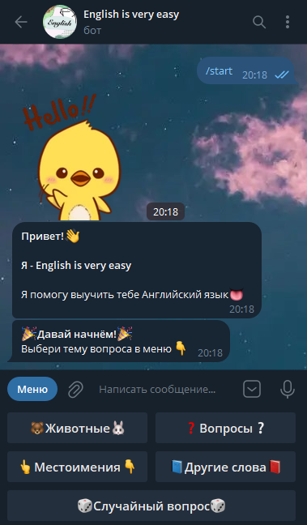

# Телеграм-бот, где можно проверить свои знания английского, через тесты.

# Использовано
- Язык: Node.js (JavaScript)
- Библиотека: grammY

# Ссылка на документацию про библиотеку телеграм бота
- https://grammy.dev/

# Ссылка на телеграм бот
- t.me/EnglishQuestionsTelegramBot
- @EnglishQuestionsTelegramBot

# Внешний вид

